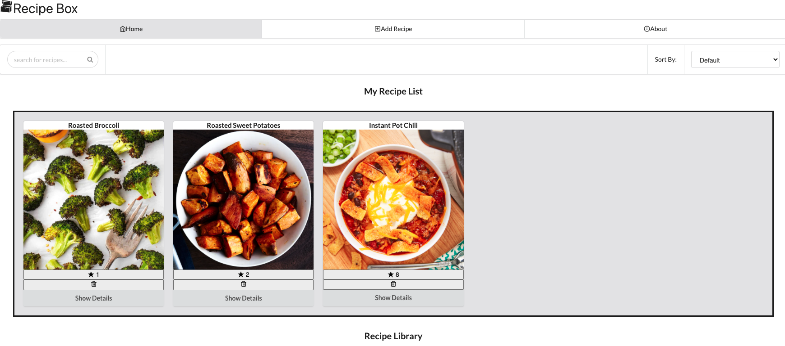
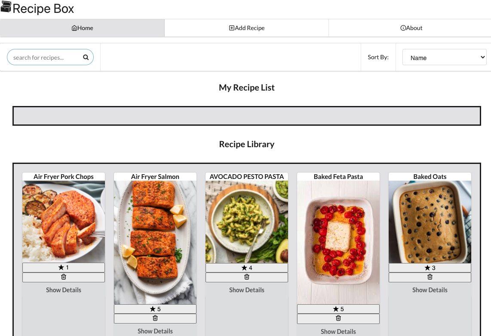
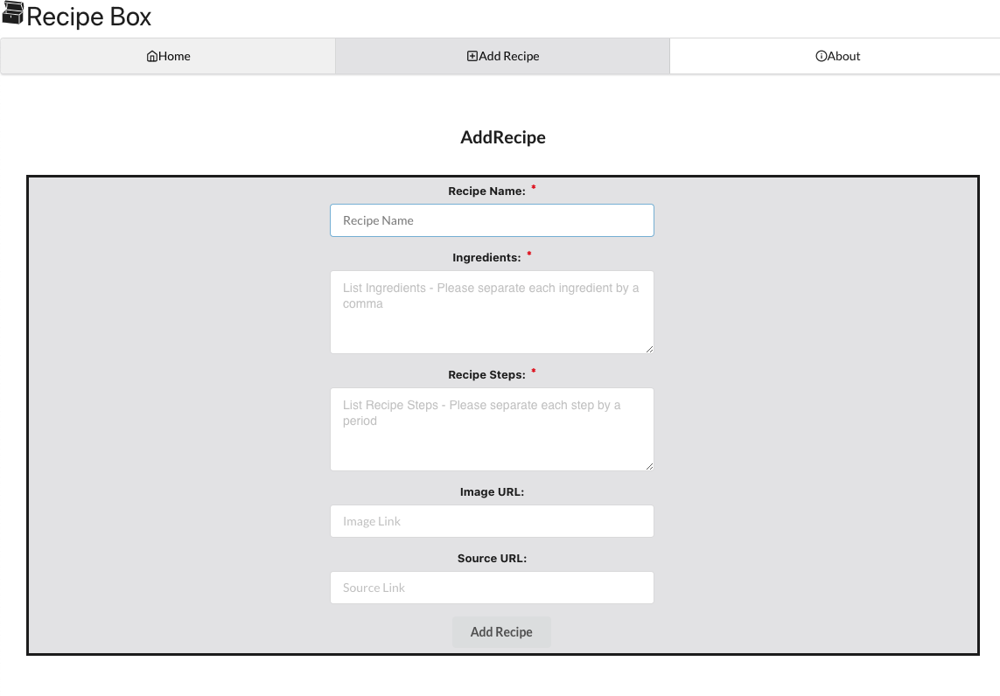

# Recipe Box

This is an application that shows a list of recipes. It is a single page application built using React. It has 12 components and 3 client side routing. It also uses a JSON server to store and manipulate the list of recipes and their details. 

## User Stories

The application allows the user to

    * add their own recipes both to the front and back-end
    * save recipes they want to try in a separate section
    * remove recipes from their "to try" section
    * delete recipes from both the front and back-end if they are no longer interested
    * search recipes by name
    * sort recipes by name or by default
    * star recipes they like

## Data Storage

This application uses a JSON server to store and manipulate data using the following requests

    * GET request: to fetch the list of recipes and their details
    * POST request: to add a new recipe to the app
    * PATCH request: to add stars to a recipe
    * DELETE request: to delete a recipe 

## Styling

This application uses semantic UI and some css code for styling.

## Authors

Hannah Glazier: https://github.com/HannahGlazier
Beth Fekadu: https://github.com/8eth